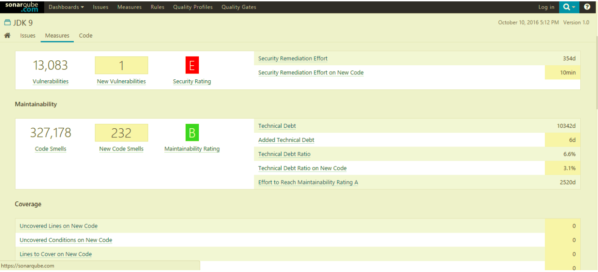
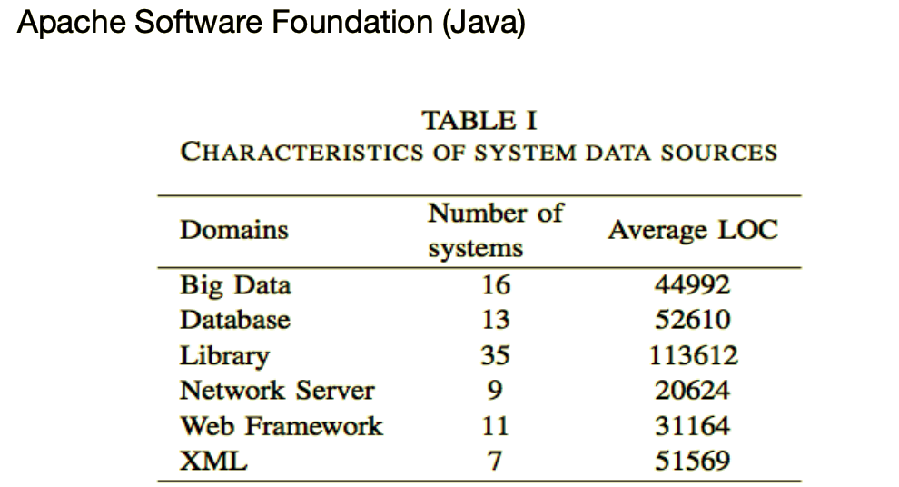
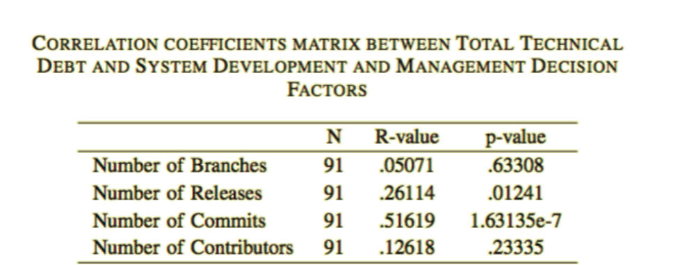

# Technical-Debt---Research-Work

## Empirical Study of Technical debt in Open Source Software Systems.

## What is Technical Debt?
- In 1992, Ward Cunningham described technical debt as
writing immature or “not quite right” code in order to ship a
new product to market faster.
- Technical Debt consists of:
  • Principle: measures the cost or effort for eliminating technical
  debt .
  • Interest: measures the extra cost or effort over some period of
  time incurred for NOT eliminating the technical debt.
  
## Why do we consider Technical Debt ?
- Decrease current release Cost.
- Release faster and sooner.
- Gather more information.
- Delay Decisions.

## Technical Debt Consequences
- Increased time to delivery.
- Increased number of defects.
- Raising maintainability cost.
- Decreased customer satisfaction. 

- Based on the analysis of 1400 applications containing 550 million lines of code submitted by 160 organizations, theaverage Technical Debt per LOC of $3.61.
- The average cost of Java apps was even higher: $5.42 per line of code. 

### Research Question #1: Does the size of the source code
relate to the total technical debt and the technical debt density.
### Research Question #2: 
Do the total technical debt and the technical debt density in a software vary among domains?
### Research Question #3: 
Do system development and management decisions including number of commits, releases, branches, and contributors relate to the total technical debt and the technical debt density? 

## Technical Debt Calculation
 Sonarqube is used for analysing a partivular project to be tested for Technical Debt.

 - Technical Debt= Technical Debt(in _man _ hours)
 - Technical Debt Density= Technical Debt(in _man _hours)/LOC
 
 ## Data Collection
- More than one official releases.
- Latest stable release source code is available.
- Software system falls under one and only one domain.
- The programming language is only java.
- Well-presented in the community.
- Active Git repository

## Data Analysis - 
- Evaluation on system development and management decisions hypothesis (RQ#3)
- Pearson Correlation Test
- Significance level is set to 0.05 Confidence level=95%

## Results of Pearson Correlation

Tool for COunting the number of classes in a java project

http://www.campwoodsw.com/sourcemonitor.html
https://www.ndepend.com/

### Difference between ANT and Maven
- Both Ant and Maven are build tools.
Maven came after ANT and offers much more than a build tool. Main difference between ANT and Maven is that In ANT you need to define every thing i.e. source directory, build directory, target directory etc while Maven adopts principle of Convention over configuration. Which means Maven has predefined project structure i.e. standard directory for source files, test files and resources
- Ever since Maven has released, many Java programmer compare Maven and ANT, which is pretty natural. Even I have taken some time to adopt Maven because I was very used to ANT build process. Eventually I realized Maven offers more convenience as build tool than ANT and also enforces a common way to build Java applications among multiple projects, developers and organization. Before shifting to Maven, I had worked with very complex ANT scripts, in-fact every project I work has different build structure than other. In order to make a release, you need to spend considerable time to understand whole build process e.g. from where does libraries are coming, are they coming as JAR or project is building them during build time etc. Maven solves many of these problem by introducing standard convention and better dependency management.

Read more: https://javarevisited.blogspot.com/2015/01/difference-between-maven-ant-jenkins-and-hudson.html#ixzz5xG1PB8SH

Read more: https://javarevisited.blogspot.com/2015/01/difference-between-maven-ant-jenkins-and-hudson.html#ixzz5xG0q3l5j
Tutorial for installing and running ANT 

Refer: https://www.mkyong.com/ant/how-to-apache-ant-on-mac-os-x/

1. Get ANT from Apache Ant website and get the tar.gz file.
2. Extract it using tar vxf apache-ant-1.9.4-bin.tar.gz
3. Navigate to bin folder under Apache Ant folder and 
ant -v
4. Apache Ant(TM) version 1.9.4 compiled on April 29 2014
   Trying the default build file: build.xml
   Buildfile: build.xml does not exist!
   Build failed

4. Something like this would be printed if you have correctly install ANT
6. Setup the environmental variables for ANT
vim ~/.bash_profile
export JAVA_HOME=$(/usr/libexec/java_home)
export GRADLE_HOME=/Users/mkyong/gradle
export M2_HOME=/Users/mkyong/apache-maven-3.1.1

#### Apache Ant
export ANT_HOME=/Users/mkyong/apache-ant-1.9.4

#### Export to PATH
export PATH=$PATH:$GRADLE_HOME/bin:$M2_HOME/bin:$ANT_HOME/bin
Now you should be able to run the ant -v  command anywhere
7. In order to use ant with sonarqube try running 
 Ant sonar if the project has a build.xml

8. https://docs.sonarqube.org/display/SCAN/Analyzing+with+SonarQube+Scanner+for+Ant

SonarQube is an open-source platform developed by SonarSource for continuous inspection of code quality to perform automatic reviews with static analysis of code to detect bugs, code smells, and security vulnerabilities on 20+ programming languages. SonarQube offers reports on duplicated code, coding standards, unit tests, code coverage, code complexity, comments, bugs, and security vulnerabilities.

SonarQube can record metrics history and provides evolution graphs. SonarQube provides fully automated analysis and integration with Maven, Ant, Gradle, MSBuild and continuous integration tools (Atlassian Bamboo, Jenkins, Hudson, etc.).[4][5][6]
