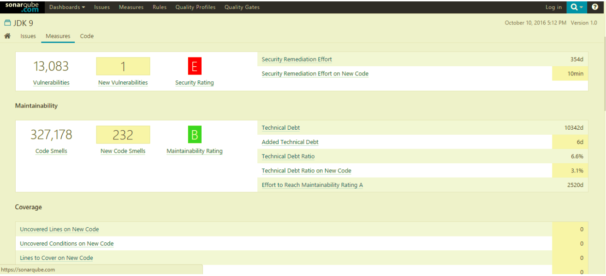

# Technical-Debt---Research-Work

## Empirical Study of Technical debt in Open source software systems.

## What is Technical Debt?
- In 1992, Ward Cunningham described technical debt as
writing immature or “not quite right” code in order to ship a
new product to market faster.
-Technical Debt consists of:
  • Principle: measures the cost or effort for eliminating technical
  debt .
  • Interest: measures the extra cost or effort over some period of
  time incurred for NOT eliminating the technical debt.
  
## Why do we consider Technical Debt ?
- Decrease current release Cost.
- Release faster and sooner.
- Gather more information.
- Delay Decisions.

## Technical Debt Consequences
- Increased time to delivery.
- Increased number of defects.
- Raising maintainability cost.
- Decreased customer satisfaction. 

- Based on the analysis of 1400 applications containing 550 million lines of code submitted by 160 organizations, theaverage Technical Debt per LOC of $3.61.
- The average cost of Java apps was even higher: $5.42 per line of code. 

### Research Question #1: Does the size of the source code
relate to the total technical debt and the technical debt density.
### Research Question #2: 
Do the total technical debt and the technical debt density in a software vary among domains?
### Research Question #3: 
Do system development and management decisions including number of commits, releases, branches, and contributors relate to the total technical debt and the technical debt density?

## Technical Debt Calculation
 Sonarqube is used for analysing a partivular project to be tested for Technical Debt.
 
 
